# Plano para transformar a Entrega 2 em Entrega 3

**Objetivo:** produzir uma replicação parcial e financeiramente viável do A-Mem que cumpra os requisitos de Reprodutibilidade em Pesquisa e Métodos Quantitativos e Experimentação, com desenho experimental explícito, repetições, randomização, análise estatística coerente com a estrutura dos dados e pacote público reproduzível. O alvo é um estudo de caso experimental sobre o `sample 0`, não uma estimativa do desempenho no LoCoMo completo.

**Estado em 15 de julho de 2026:** execução, análise, artigo, PDF e validação local concluídos. Restam publicação, depósito/DOI, verificação dos links e formulário.

## 0. Progresso comprovado

| Faixa | Estado | Evidência atual |
|---|---|---|
| T1 | Concluída | `protocolo-entrega-3.md` congela escopo, hipóteses, blocos, randomização, análise e falhas antes da coleta. |
| T2 | Concluída | Mapeamento oficial de categorias centralizado e coberto por teste. |
| T3 | Concluída para o ambiente usado | `requirements.lock.txt`, Python/plataforma e instruções existem; testes e análise passam com o ambiente travado. |
| T4–T6 | Concluídas offline | Uso, custo, tentativas, blocos, posições, samples, caches isolados, agenda balanceada e retomada estão instrumentados e testados sem API. |
| T7–T8 | Concluídas offline | Análise por cinco blocos e exportação determinística de CSV/LaTeX/PDF estão cobertas por fixtures sintéticas. |
| T9 | Concluída | Suíte offline, compilação, manifesto final e verificações de segurança foram executados. |
| T10–T15 | Concluídas | Os quinze resultados `R1–R5 × k`, auditoria, análise, tabelas, figuras e manifesto estão completos. |
| T16–T18 | Concluídas localmente | Artigo/PDF final revisado e pacote candidato validado em cópia limpa; a URL real pertence a T19. |
| T19–T21 | Pendente externo | GitHub/release, depósito arquivístico/DOI, verificação pública e formulário exigem autorização e ação externa. |

O manifesto final registra `complete=true`, quinze resultados observados, nenhuma
execução ausente e nenhum arquivo obrigatório ausente.

## 1. Critério de conclusão

O trabalho estará pronto quando:

- as hipóteses e o plano de análise estiverem congelados antes da execução principal;
- o diálogo completo selecionado pelo recorte de 10% for avaliado em `k = 3, 5, 10`;
- houver cinco blocos de repetição, com caches próprios e ordem de `k` randomizada e registrada;
- a análise tratar o bloco de execução como unidade de repetição e as 199 perguntas como casos fixos dentro do diálogo;
- F1, tempo, tokens e custo forem registrados por bloco e configuração;
- as conclusões forem sustentadas por intervalos de confiança, testes/contrastes predefinidos, tamanhos de efeito e análise de variabilidade;
- código, ambiente, dados, resultados, scripts, manifesto e instruções passarem por uma reprodução a partir de clone limpo;
- o Kit de Reprodução estiver organizado com nomes claros e sem caches, logs privados, ambientes virtuais ou arquivos desnecessários;
- o código estiver público no GitHub e uma versão imutável do kit estiver arquivada em OSF, Zenodo, Figshare ou equivalente, com DOI quando viável;
- todos os links públicos forem testados sem autenticação;
- o artigo e o PDF forem regenerados a partir dos artefatos finais e revisados visualmente.

## 2. Requisitos rastreáveis

| ID | Requisito | Aceite verificável |
|---|---|---|
| EXP-01 | Hipóteses testáveis | Documento registra H0/H1, métrica primária, contrastes, alfa e regra de decisão antes dos resultados. |
| EXP-02 | Unidade experimental correta | Bloco de execução é a unidade de repetição condicional; perguntas são casos fixos aninhados no único diálogo. A inferência não é extrapolada para outros diálogos. |
| EXP-03 | Fatores e níveis | Fator principal `retrieve_k` tem níveis 3, 5 e 10; modelo, dataset, temperaturas e backend ficam controlados. |
| EXP-04 | Repetições | Cinco blocos completos são executados e identificados por `replicate_id`. |
| EXP-05 | Randomização | A ordem dos três valores de `k` é randomizada dentro de cada bloco por uma seed predefinida e auditável. |
| EXP-06 | Instrumentação | Cada execução registra duração, chamadas, tokens de entrada/cache/saída e custo estimado por configuração. |
| STAT-01 | Variabilidade | Relatório apresenta média, mediana, desvio-padrão, IQR e distribuição entre blocos; a distribuição por pergunta é claramente descritiva. |
| STAT-02 | Inferência | Contrastes pareados têm IC 95%, teste predefinido, tamanho de efeito e ajuste de multiplicidade. |
| STAT-03 | Pressupostos | Normalidade dos deltas/resíduos é verificada ou o uso de método não paramétrico é justificado. |
| REPRO-01 | Ambiente | Dependências estão travadas, versões e hashes são registrados e segredos ficam fora do repositório. |
| REPRO-02 | Regeneração | Um único comando regenera relatório, tabelas e figuras a partir dos JSONs finais. |
| REPRO-03 | Auditoria pública | Clone limpo executa instalação, smoke test e análise sem arquivos locais ocultos. |
| KIT-01 | Organização do kit | Pacote contém código, dados/instruções, scripts, resultados, documentação, licença, ambiente e manifesto em estrutura clara. |
| KIT-02 | Limpeza | Caches, logs privados, `.env.local`, ambientes virtuais, temporários e duplicatas não entram no pacote público. |
| KIT-03 | Autonomia | Terceiro consegue entender, instalar, executar e analisar sem entrar em contato com o autor. |
| PUB-01 | Código aberto | Repositório GitHub está público e todos os links funcionam sem autenticação. |
| PUB-02 | Arquivo persistente | Release final é depositada em OSF, Zenodo, Figshare ou equivalente; DOI é registrado quando oferecido/viável. |
| PUB-03 | Correspondência | Commit, release, depósito, manifesto e artigo apontam para a mesma versão dos artefatos. |
| PAPER-01 | Artigo final | Metodologia, resultados, ameaças e conclusões refletem somente o protocolo realmente executado. |
| PAPER-02 | Seção de reprodutibilidade | Artigo informa links, recursos, instalação, execução, regeneração dos resultados e limitações. |
| SUBMIT-01 | Entrega | Formulário recebe o PDF final e os links públicos verificados. |

## 3. Protocolo experimental recomendado

### 3.1 Cenários e dados

- Dataset: `sample 0` completo de `data/locomo10.json`, com 19 sessões, 419 turnos e 199 perguntas.
- Cenários: `retrieve_k` em `{3, 5, 10}`.
- Métrica primária: F1.
- Métricas secundárias: exact match, BLEU-1, ROUGE-1 F, METEOR e SBERT.
- Métricas operacionais: duração por bloco/configuração, chamadas, tokens e custo.
- Unidade de repetição para inferência condicional: bloco de execução com cache próprio.
- Estrutura: o diálogo e suas 199 perguntas ficam fixos; cada bloco recria a memória e mede os três cenários. As conclusões valem para esse caso experimental, não para a população de diálogos do LoCoMo.

### 3.2 Hipóteses predefinidas

- **H1 primária:** `k=10` aumenta o F1 médio no diálogo avaliado em relação a `k=3`.
  - Estimando: em cada bloco, diferença entre os F1 médios das 199 perguntas em `k=10` e `k=3`.
  - H0: a probabilidade de um delta positivo entre blocos é menor ou igual a 0,5.
  - H1: a probabilidade de um delta positivo entre blocos é maior que 0,5.
- **H1 secundárias:** `k=5` versus `k=3` e `k=10` versus `k=5`, com ajuste de Holm.
- **H2 exploratória:** o efeito de `k` varia entre categorias oficiais do LoCoMo dentro do diálogo avaliado. Os resultados por categoria não serão confirmatórios por causa do número reduzido de perguntas em algumas categorias.
- **H3:** valores maiores de `k` aumentam tempo, tokens e custo por execução.

### 3.3 Repetição e randomização

Plano viável recomendado:

1. Criar cinco blocos de repetição `R1` a `R5`, cada um com cache próprio.
2. Cada bloco cria seu próprio namespace de cache, de forma que a construção da memória seja repetida.
3. Dentro de cada bloco, o mesmo cache é compartilhado pelos três valores de `k`, isolando o efeito de recuperação.
4. A ordem de `k` é randomizada com uma seed de agendamento registrada antes da execução.
5. Resultados nunca são sobrescritos; o nome inclui bloco, `k`, hash do dataset e timestamp.
6. Falhas e retentativas seguem política predefinida; não se repetem seletivamente apenas resultados desfavoráveis.

### 3.4 Análise estatística

- Produzir uma linha por `replicate_id × k`, com métricas agregadas e resultados das 199 perguntas preservados para auditoria.
- Calcular um delta pareado de F1 por bloco para cada contraste entre valores de `k`.
- Para o contraste primário, usar teste exato de sinais unilateral sobre os cinco deltas entre blocos. Com cinco deltas não nulos, a resolução mínima unilateral é `p=0,03125`; com três, seria `p=0,125`.
- Reportar IC 95% dos deltas entre blocos. O bootstrap pareado por pergunta pode ser apresentado apenas como análise descritiva condicionada às 199 perguntas do diálogo, nunca como evidência sobre o LoCoMo completo.
- Separar a variabilidade entre execuções da variabilidade entre perguntas e não tratar 199 perguntas correlacionadas como 199 réplicas independentes.
- Reportar diferença absoluta, diferença relativa e tamanho de efeito pareado.
- Verificar normalidade dos deltas com gráfico Q-Q e Shapiro-Wilk, deixando explícito que a decisão principal não dependerá de normalidade se for adotado o método não paramétrico.
- Ajustar os contrastes secundários com Holm.
- Tratar categorias como análise exploratória; não ajustar um modelo complexo `k × categoria` com apenas um diálogo.
- Realizar análise de sensibilidade comparando a inferência ingênua por pergunta com a inferência correta pelos cinco blocos. A conclusão deve usar a análise por bloco.

## 4. Opções de custo e decisão

As estimativas abaixo foram geradas pelo estimador local e continuam incertas.

Premissa de preço conferida em 14/07/2026 na documentação oficial do GPT-4o mini: US$0,15 por milhão de tokens de entrada, US$0,075 para entrada em cache e US$0,60 por milhão de tokens de saída. O estimador local usa US$0,15/US$0,60 e, portanto, não antecipa integralmente eventual desconto de entrada em cache.

| Opção | Desenho no `sample 0` | Tempo central | Custo central | Avaliação |
|---|---|---:|---:|---|
| A — recomendada | 5 caches independentes + 15 avaliações, cinco por `k` | aproximadamente 6,5 h | aproximadamente US$5,12 | Permite teste exato com resolução inferior a 5% e captura variabilidade de memória e resposta. |
| B — econômica | 1 cache fixo + 15 avaliações, cinco por `k` | aproximadamente 3,3 h | aproximadamente US$3,16 | Permite repetição da resposta, mas condiciona tudo a uma única memória construída. |
| C — mínima | 3 caches independentes + 9 avaliações, três por `k` | aproximadamente 3,9 h | aproximadamente US$3,07 | Mede variabilidade, mas um teste exato com três blocos não pode atingir 5% de significância. |
| D — sem novo custo | Reanalisar os três JSONs existentes | sem nova execução | US$0 | Melhora transparência e estatística descritiva, mas não atende ao requisito de repetições independentes. |

**Gate de orçamento:** concluir primeiro toda a instrumentação offline e um smoke mínimo. Só depois comparar custo/tempo observado com a estimativa e autorizar A, B ou C. Para atender melhor ao enunciado sem executar o dataset completo, a opção A é a recomendada.

## 5. Fases de execução

```mermaid
flowchart LR
    T1["T1 Congelar protocolo"] --> T2["T2 Corrigir categorias"]
    T1 --> T3["T3 Travar ambiente"]
    T1 --> T4["T4 Instrumentar uso e custo"]
    T2 --> T7["T7 Análise por repetições"]
    T4 --> T5["T5 Metadados por bloco"]
    T5 --> T6["T6 Runner randomizado"]
    T3 --> T9["T9 Validação offline"]
    T6 --> T9
    T7 --> T9
    T2 --> T8["T8 Exportação do artigo"]
    T7 --> T8
    T8 --> T9
    T9 --> T10["T10 Smoke e piloto"]
    T10 --> T11["T11 Piloto de um diálogo"]
    T11 --> G1{"G1 Aprovar orçamento"}
    G1 --> T12["T12 Execução principal"]
    T12 --> T13["T13 Auditoria dos resultados"]
    T13 --> T14["T14 Análise final"]
    T14 --> T15["T15 Tabelas e figuras"]
    T15 --> T16["T16 Revisar artigo"]
    T16 --> T17["T17 Gerar e revisar PDF"]
    T17 --> T18["T18 Validar clone limpo"]
    T18 --> T19["T19 Publicar GitHub"]
    T19 --> T20["T20 Arquivar kit e DOI"]
    T20 --> T21["T21 Verificar links e formulário"]
```

### Fase 0 — congelar o protocolo

#### T1. Especificar o protocolo estatístico

- **Onde:** novo `protocolo-entrega-3.md`.
- **Depende de:** nada.
- **Entrega:** hipóteses, desfechos, unidade experimental, blocos, randomização, exclusões, política de falha, teste primário e análises secundárias.
- **Verificação:** todos os requisitos `EXP-*` e `STAT-*` estão mapeados; o documento recebe hash e data anteriores à execução principal.

### Fase 1 — corrigir e preparar sem custo de API

#### T2. Centralizar e testar o mapeamento de categorias

- **Onde:** `amem/analysis/category_mapping.py`, `summarize_results.py`, `export_article_assets.py` e testes associados.
- **Depende de:** T1.
- **Entrega:** uma única fonte define 1=multi-hop, 2=temporal, 3=open-domain, 4=single-hop e 5=adversarial.
- **Verificação:** teste unitário falha para qualquer permutação; relatório e figura de fixture exibem o mesmo mapeamento.

#### T3. Travar e documentar o ambiente

- **Onde:** `amem/requirements.lock.txt`, script de captura do ambiente e README.
- **Depende de:** T1.
- **Entrega:** versões exatas, versão do Python, plataforma e comando de instalação reproduzível.
- **Verificação:** ambiente novo instala as versões declaradas; segredo continua somente em `.env.local`.

#### T4. Instrumentar uso e custo por chamada

- **Onde:** `amem/memory_layer_robust.py` e testes unitários do controlador.
- **Depende de:** T1.
- **Entrega:** coletor acumula chamadas, tokens de entrada, tokens em cache, tokens de saída, modelo e tentativas sem registrar prompts nem chaves.
- **Verificação:** respostas OpenAI simuladas geram totais exatos; retries não são contados incorretamente; JSON não contém segredo.

#### T5. Registrar blocos, amostra e tempos

- **Onde:** `amem/test_advanced_robust.py` e testes de metadados.
- **Depende de:** T4.
- **Entrega:** `replicate_id`, `sample_id`, `schedule_seed`, ordem de `k`, namespace de cache, duração por bloco/configuração e totais de uso/custo entram no JSON.
- **Verificação:** fixture com dois blocos produz metadados completos e nomes de saída não colidem.

#### T6. Criar runner retomável e randomizado

- **Onde:** novo `amem/run_entrega3.py` ou `run_entrega3.sh` com agenda JSON versionada.
- **Depende de:** T5.
- **Entrega:** gera a agenda dos blocos, randomiza `k`, cria caches isolados e retoma apenas unidades ausentes/inválidas.
- **Verificação:** duas gerações com a mesma seed são idênticas; seed diferente muda a ordem; simulação de interrupção retoma sem sobrescrever resultados válidos.

#### T7. Implementar análise de execuções repetidas

- **Onde:** novo `amem/analysis/analyze_entrega3.py` e testes com dados sintéticos.
- **Depende de:** T1 e T2.
- **Entrega:** resumo por bloco, IC dos deltas, permutação exata, ajuste de Holm, efeito, normalidade/QQ e análise de sensibilidade por pergunta.
- **Verificação:** dados sintéticos com efeito conhecido recuperam sinal e sinal algébrico esperados; dados sem efeito não produzem falso ganho determinístico.

#### T8. Adaptar exportação de artigo

- **Onde:** `amem/analysis/export_article_assets.py`.
- **Depende de:** T2 e T7.
- **Entrega:** tabelas e figuras finais usam a saída por repetições e incluem variabilidade entre blocos.
- **Verificação:** regeneração determinística produz os mesmos hashes a partir das mesmas entradas.

#### T9. Executar gate offline

- **Onde:** todo o pacote.
- **Depende de:** T3, T6, T7 e T8.
- **Entrega:** testes, lint/sintaxe, fixture e regeneração sem rede.
- **Verificação:** `pytest` passa; compilação Python passa; nenhum arquivo contém `OPENAI_API_KEY` ou padrão de chave; nenhuma chamada externa é feita.

### Fase 2 — smoke, piloto e autorização

#### T10. Executar smoke instrumentado

- **Depende de:** T9.
- **Entrega:** execução mínima comprova coleta de métricas, tokens, custo, nomes, cache, retomada e análise.
- **Verificação:** JSON passa pelo validador e relatório é gerado sem correção manual.
- **Gate:** requer autorização para chamadas à OpenAI.

#### T11. Executar piloto de um diálogo completo

- **Depende de:** T10.
- **Entrega:** um bloco piloto com os três valores de `k`, em ordem randomizada.
- **Verificação:** comparar tempo/tokens/custo observados com o estimador; atualizar orçamento e duração.
- **Decisão:** escolher opção A, B ou C e registrar a justificativa metodológica e financeira.

### Fase 3 — execução principal

#### T12. Executar os blocos completos

- **Depende de:** T11 e aprovação explícita do orçamento.
- **Entrega:** todos os cinco `replicate_id × k` previstos, cobrindo o diálogo completo do `sample 0`.
- **Verificação:** matriz de completude sem células ausentes; hashes, timestamps, versões e agenda coincidem com o protocolo.

#### T13. Auditar resultados antes da análise

- **Depende de:** T12.
- **Entrega:** relatório de completude, duplicatas, falhas, retries, outliers operacionais e hashes.
- **Verificação:** nenhuma execução seletivamente excluída; qualquer desvio do protocolo aparece em tabela própria.

### Fase 4 — análise e artefatos

#### T14. Gerar análise estatística final

- **Depende de:** T13.
- **Entrega:** resultados primários, secundários, exploratórios, variabilidade, pressupostos e sensibilidade.
- **Verificação:** todas as afirmações têm tabela/figura ou resultado numérico rastreável; distinção entre confirmatório e exploratório está explícita.

#### T15. Regenerar tabelas, figuras e manifesto

- **Depende de:** T14.
- **Entrega:** assets do artigo, relatório Markdown, dados derivados e manifesto SHA-256.
- **Verificação:** comando único regenera tudo; não há edição manual dos valores finais.

### Fase 5 — artigo e publicação

#### T16. Revisar o artigo

- **Onde:** `entrega_2_reprodutibilidade_patrick_santos.tex`, renomeando a versão final se necessário.
- **Depende de:** T15.
- **Entrega:** metodologia e resultados atualizados; hipóteses formalizadas; estatística, variabilidade, normalidade/método não paramétrico e repetições documentadas.
- **Verificação:** cada requisito da seção 2 aponta para uma seção, tabela ou artefato do artigo.

#### T17. Gerar e revisar o PDF

- **Depende de:** T16.
- **Entrega:** PDF final compilado.
- **Verificação:** referências resolvidas; tabelas e figuras legíveis; sem overflow, cortes, placeholders ou inconsistência numérica.

#### T18. Validar o Kit de Reprodução em clone limpo

- **Depende de:** T17.
- **Entrega:** pacote candidato com URL real, lockfile, licença, scripts, dados/instruções, resultados, análise, manifesto e documentação.
- **Verificação:** em diretório temporário vazio, clone + instalação + análise reproduzem os hashes esperados sem depender de arquivos locais; smoke pago fica opcional e claramente marcado.

#### T19. Publicar a versão final no GitHub

- **Depende de:** T18 e autorização explícita para publicação externa.
- **Entrega:** repositório público limpo, tag/release imutável e links permanentes para o commit e a release.
- **Verificação:** acesso anônimo ao README, código, dados permitidos, scripts, resultados e release; nenhum segredo ou caminho local aparece no pacote.

#### T20. Arquivar o Kit de Reprodução

- **Depende de:** T19 e escolha da plataforma aberta.
- **Entrega:** depósito no OSF, Zenodo, Figshare ou equivalente contendo a mesma release; DOI quando a plataforma oferecer e isso for viável.
- **Verificação:** hash/versão do depósito coincide com a release GitHub; metadados incluem título, autor, resumo, licença, palavras-chave e vínculo com o artigo.

#### T21. Verificar links e preparar a submissão

- **Depende de:** T20.
- **Entrega:** checklist final e dados necessários para responder ao formulário da Etapa 3.
- **Verificação:** PDF final anexável; links do GitHub e do arquivo persistente abrem sem autenticação; DOI resolve; artigo contém a mesma versão e os mesmos links.

## 6. Gates de qualidade

| Gate | Momento | Condição para avançar |
|---|---|---|
| G0 — protocolo | antes do código experimental | Hipóteses e análise aprovadas e congeladas. |
| G1 — offline | antes de usar API | Testes, fixtures, mapeamento, lock e segurança passam. |
| G2 — piloto | antes da execução completa | Métricas e custo por configuração são auditáveis; orçamento atualizado. |
| G3 — completude | antes da análise | Todas as unidades previstas existem ou desvios estão formalmente registrados. |
| G4 — inferência | antes de escrever conclusões | Unidade experimental, ICs, testes e efeitos foram validados. |
| G5 — reprodução | antes da publicação | Clone limpo regenera análise e artefatos sem dependências ocultas. |
| G6 — ciência aberta | antes da entrega | GitHub, arquivo persistente/DOI e links do artigo estão públicos, alinhados e testados anonimamente. |

## 7. Validação do plano

### Dependências

| Tarefa | Dependências conferidas | Status |
|---|---|---|
| T1 | nenhuma | OK |
| T2, T3, T4 | T1 | OK |
| T5 | T4 | OK |
| T6 | T5 | OK |
| T7 | T1, T2 | OK |
| T8 | T2, T7 | OK |
| T9 | T3, T6, T7, T8 | OK |
| T10 | T9 | OK |
| T11 | T10 | OK |
| T12 | T11 + aprovação | OK |
| T13–T21 | sequência T12 → T21 | OK |

### Testes no mesmo trabalho que altera o código

| Tarefa de código | Teste exigido na própria tarefa | Gate |
|---|---|---|
| T2 | unitário de mapeamento e fixture de exportação | G1 |
| T3 | instalação/versões em ambiente limpo | G1 |
| T4 | unitário com respostas OpenAI simuladas | G1 |
| T5 | unitário de schema, agregação e nomes | G1 |
| T6 | unitário de agenda, randomização e retomada | G1 |
| T7 | unitário estatístico com dados sintéticos | G1/G4 |
| T8 | snapshot/hash de tabelas e figuras | G1/G4 |

## 8. Ordem prática imediata

1. Aprovar este plano e escolher provisoriamente A, B ou C.
2. Escrever e congelar `protocolo-entrega-3.md`.
3. Concluir T2–T9 sem chamadas à API.
4. Solicitar autorização para T10 e T11.
5. Recalcular custo e decidir definitivamente A, B ou C.
6. Executar, auditar, analisar, revisar o artigo e validar o clone limpo.
